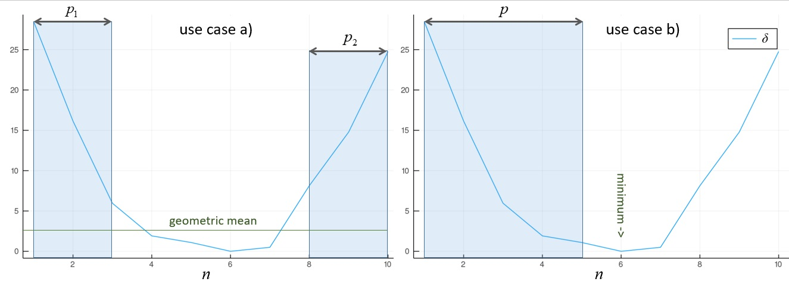

# CSP

The *Common Spatial Pattern* (CSP) are filters obtained by **generalized eigenvalue-eigenvector decomposition**.
They corresponds to the situation ``m=1`` (one dataset) and ``k=2`` (two observation). The goal of a CSP filter is
to maximize a variance ratio.
Let ``(X_1, X_2)`` be ``(n⋅t_1, n⋅t_2)`` data matrices, where ``n`` is their number of variables and ``(t_1, t_2)`` their number of samples. Let ``(C_1, C_2)`` be the ``n⋅n`` covariance matrices of data matrices ``(X_1, X_2)``
and ``C=C_1+C_2``. The CSP consists in the joint diagonalization of ``C`` and ``C_1`` or, equivalently, of ``C`` and ``C_2`` (Fukunaga, 1990, p. 31-33 [🎓](@ref)). The joint diagonalizer ``B`` is scaled such as to verify (see [scale and permutation](@ref))

``\left \{ \begin{array}{rl}B^TCB=I\\B^TC_1B=Λ\\B^TC_2B=I-Λ \end{array} \right.``, ``\hspace{1cm}`` [csp.1]

That is to say, ``λ_1≥\ldots≥λ_n`` are the diagonal elements of ``B^TC_1B``
and ``1-λ_1≤\ldots≤1-λ_n`` the diagonal elements of ``B^TC_2B``. The CSP maximizes the ratio between the variance of the
corresponding components of transformed processes ``B^TX_1`` and ``B^TX_2``,
constraining their sum to unity. The ratio is ordered by descending order
such as

``σ=[λ_1/(1-λ_1)≥\ldots≥λ_n/(1-λ_n)]``, ``\hspace{1cm}`` [csp.2]

The CSP has two use cases, which can be selected using the `selMeth`
optional keyword argument of its constructors:

- **a) Separating two classes**.
    In this case ``C_1`` and ``C_2`` are
    covariance matrices of two distinct classes. The constructors will
    retain a filter with form
    ``\widetilde{B}=[B_1 B_2]``, where we have defined partitions
    ``B=[B_1 B_0 B_2]``. ``B_1`` and ``B_2`` are the first ``p_1`` and last ``p_2`` vectors of ``B`` corresponding to high and low values of
    the variance ratio [csp.2], that is, explaining variance
    that is useful for separating the classes, while ``B_0`` corresponds
    to components corresponding to variance ratios close to ``1``,
    meaning that are not useful for separating the classes.
    The subspace dimension in this use case will be given by ``p=p_1+p_2``.
    Notice that in *Diagonalizations.jl* we allow ``p_1≠p_2``.
- **b) Enhance the signal-to-noise ratio**.
    In this case ``C_1`` and ``C_2`` are
    covariance matrices of the 'signal' and of the 'noise', respectively.
    The constructors will retain a filter ``\widetilde{B}=[b_1 \ldots b_p]`` holding the first ``p`` vectors of ``B`` corresponding to the highest
    values of the variance ratio [csp.2]. The discared ``n-p`` vectors
    correspond to components that explains progressively more and more
    variance related to the noise process. In this case we have
    a natural landmark for selecting automatically the
    [subspace dimension](@ref) ``p``, as the larger dimension
    whose variance ratio is greater then ``1``.

In order to retrive the appropriate partitions of ``B`` to construct a
filter given a subspace dimension ``p``, we need a way to measure the
distance of the ratios [csp.2] from ``1``. For this purpose we will make use
of the Fisher distance adopted on the Riemannian manifold of positive definite
matrices, in its scalar form, yielding

``δ_i=\textrm{log}^2(σ_i)``, for ``i=[1 \ldots n]``. ``\hspace{1cm}`` [csp.3]

After this transformation, extreme values of the ratio becomes high,
that is, the function ``δ_i`` assumes the shape of a (non-symmetric) wine cup
and has a minimum close to zero.

Now let ``δ_{TOT}=\sum_{i=1}^nδ_i`` be the total distance and define
the *explained variance* of the CSP for dimension ``p`` such as

``v_p=\frac{\sum_{j=1}^pδ_j}{δ_{TOT}}``, ``\hspace{1cm}`` [csp.4]

where the ``δ_j``'s are given by [csp.3]. Note that for use case **a)**
described here above the accumulated sums in [csp.4] are computed after
sorting the ``δ_i`` values in descending order.

The ``.arev`` field of CSP filter
is defined as the accumulated variance ratio given by

``[v_1≤\ldots≤v_n]``, ``\hspace{1cm}`` [csp.5]

where the ``v_i``'s' are defined in [csp.4].

For setting the subspace dimension ``p`` manually, set the `eVar`
optional keyword argument of the CSP constructors either
to an integer or to a real number
(see [subspace dimension](@ref)).
If you don't, by default ``p`` is chosen (see Fig. 2)

- in **use case a)** as the larger dimension ``p`` whose sorted ``δ_p`` value
  [csp.3]  is larger then the geometric mean of ``δ`` ``1``.
  ``n÷2`` is taken as upper bound.
- in **use case b)** as the larger dimension ``p`` whose ``σ_p`` value [csp.2]
  is larger then ``1``.

 In both cases the dimension corresponding to the munimum of [csp.3] is taken
 as an upper bound and ``p`` can be equal to at most ``n-1``.

 
 **Figure 2** *Illustration of the way CSP constrcuctors determines
 automatically the subspace dimension ``p`` under use case a) and b).
 On the left, we are interested in the ``p_1`` and ``p_2`` vectors of ``B``
 associated with extremal values of the variance ratios [csp.2],
 which are the high values of ``δ`` [csp.3] enclosed in the shaded boxes
 of the figure. The threshold is set to the geometric mean
 of ``δ``. Since Diagonalizations.jl always sorts the explained variance
 in descending order, ``\widetilde{B}`` is defined as
 ``[b_1, b_{10}, b_9, b_2, b_8, b_3]``.
 On the right, we are interested in the first ``p`` vectors of
 ``B`` associated with positive values of the variance ratios [csp.2],
 which are the high values on the left of the minimum of ``δ`` enclosed
 in the shaded box of the figure.
 The threshold is set in this case to the first value of ``σ`` [csp.2]
 smaller then ``1``, which roughly coincides with the minimum of ``δ``
 reported in the figure. Assuming in this example they do coincide,
 ``\widetilde{B}`` would be defined as ``[b_1 \ldots b_5]``.*

**Solution**

The CSP solution ``B`` is given by the [generalized eigenvalue-eigenvector
decomposition](https://en.wikipedia.org/wiki/Eigendecomposition_of_a_matrix#Generalized_eigenvalue_problem)
of the pair ``(C, C_1)``.

A numerically preferable solution is the following two-step procedure:

1. get a whitening matrix ``\hspace{0.1cm}W\hspace{0.1cm}`` such that ``\hspace{0.1cm}W^TCW=I\hspace{0.1cm}``.
2. do ``\hspace{0.1cm}\textrm{EVD}(W^TC_{1}W)=UΛU^{T}``

The solution is ``\hspace{0.1cm}B=WU``.

**Constructors**

Three constructors are available (see here below). The constructed
[LinearFilter](@ref) object holding the CSP will have fields:

`.F`: matrix ``\widetilde{B}`` as defined above. This is just
``B`` of [csp.1] if optional keyword argument `simple=true` is passed to the
constructors (see below).

`.iF`: the left-inverse of `.F`

`.D`: the ``p⋅p`` diagonal matrix with the elements of ``Λ`` [csp.1]
corresponding to the vectors of ``\widetilde{B}``.

`.eVar`: the explained variance for the chosen value of ``p``,
given by the ``p^{th}`` value of [csp.5]

`.ev`: the vector `diag(Λ)` holding all ``n`` diagonal elements
of matrix ``Λ`` [csp.1].

`.arev`: the *accumulated regularized eigenvalues*, defined in [csp.5].

!!! note "Nota Bene"
    `.eVar` and `.arev` are computed on sorted ``δ_i`` values
    in use case **a)**, see [csp.5], [csp.4] and Fig. 2.

```@docs
csp
```
