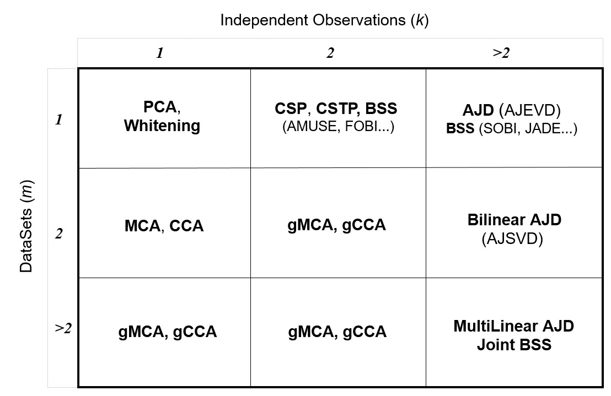

# Documentation

## Requirements & Installation

**Julia**: version ≥ 1.2

**Packages**: see the [dependencies](@ref) of the main module.

To install the package execute the following command in Julia's REPL:

    ]add Diagonalizations

### Reviewers

Independent reviewers for both the code and the documentation are welcome.
The package is throughoutly tested for the case of real data input,
not tested at all for the case of complex data input.

### TroubleShoothing

| Problem   | Solution |
|:----------|:----------|
| No problem has been reported so far |  |


### About the Authors

[Marco Congedo](https://sites.google.com/site/marcocongedo), corresponding
author, is a research scientist of [CNRS](http://www.cnrs.fr/en)
(Centre National de la Recherche Scientifique), working at
[UGA](https://www.univ-grenoble-alpes.fr/english/)
(University of Grenoble Alpes).
**Contact**: first name dot last name at gmail dot com


## Overview

*Diagonalizations.jl* implements the following **multivariate linear filters**:


**Table 1**

| Acronym   | Full Name | Datasets ( *m* ) | Observations ( *k* ) |
|:----------|:---------:|:---------:|:---------:|
| PCA | Principal Component Analysis | 1 | 1 |
| Whitening | Whitening (Sphering) | 1 | 1 |
| MCA | Maximum Covariance Analysis | 2 | 1 |
| CCA | Canonical Correlation Analysis | 2 | 1 |
| gMCA | generalized MCA | >1 | 1 |
| gCCA | generalized CCA | >1 | 1 |
| CSP | Common Spatial Pattern | 1 | 2 |
| CSTP | Common Spatio-Temporal Pattern | 1 | >1 |
| AJD | Approximate Joint Diagonalization | 1 | >1 |
| mAJD | multiple AJD | >1 | >1 |


All these filters are obtained by diagonalization procedures and can be
all understood as particular solutions to the same optimization problem, which corresponds to the mAJD problem.
(Congedo, 2013 [🎓](@ref)). They can be classified in several way.
For instance,
- the *MCA* can be seen as a bilinear version and the *gMCA* as a multi-linear version of the *PCA*.
- the *CCA* can be seen as a bilinear version and the *gMCA* as a multi-linear version of *Whitening*.
- the *AJD* can be seen as a generalization of the *PCA* and of the *CSP*.
- the *mAJD* can be seen as a generalization of all other filters.


Also,
- *PCA* and *Whitening* are based on the eigenvalues decomposition
- *MCA* and *PCA* are based on the singular values decomposition
- *CSP* and *CSTP* are based on the generalized eigenvalue decomposition.
- *gMCA*, *gCCA*, *AJD* and *mAJD* are solved by iterative algorithms generalizing the above well-known procedures.

With respect to the number of datasets ( *m* ) and observations ( *k* )  
the implemented filters fill the entries of the following table:



**Figure 1**
*Taxonomy of several diagonalization procedures and  
signal procssing methods that make use of them, depending on the number of
observations and data sets involved. Legend: see [acronyms](@ref).*

Future versions shall concentrate on implementing other iterative algorithms for solving the generalized problems. Also, this package
will be used as the base of packages implementing practical signal processing
methods such as *blind source separation*.

As compared to
[MultivariateStats.jl](https://github.com/JuliaStats/MultivariateStats.jl)
this package supports :
- the `dims` keyword
- shrinkage covariance matrix estimations throught package [CovarianceEstimation](https://github.com/mateuszbaran/CovarianceEstimation.jl)
- average covariance estimations with metrics for the manifold of positive definite matrices using the [PosDefManifold](https://github.com/Marco-Congedo/PosDefManifold.jl) package
- automatic procedures to set the subspace dimension
- diagonalization procedures for the case ``m≥2`` and ``k≥2`` (see Fig. 1).


## Code units

**Diagonalizations.jl** includes seven code units (.jl files):

| Unit   | Description |
|:----------|:----------|
| Diagonalizations.jl | Main module, declaring constants, types and structs |
| pca.jl | Unit implementing the PCA and the Whitening |
| cca.jl | Unit implementing the MCA and the CCA |
| gcca.jl | Unit implementing the gMCA and the gCCA |
| csp.jl | Unit implementing the CSP and CSTP|
| ajd.jl | Unit implementing the AJD and the mAJD |
| tools.jl | Unit containing general tools and internal functions|
| JoB.jl | Unit implementing the OJoB and (later on) NOJoB iterative algorithms (in the 'optim' folder)|

Furthermore, all examples given at the end of the documentation of the filter
constructors are collected as .jl units in the 'examples' folder.

## 🎓

**References**

A. Belouchrani, K. Abed-Meraim, J. Cardoso, E. Moulines (1997), [A blind
source separation technique using second order statistics](https://pdfs.semanticscholar.org/1889/e9f39f76abf8a64b9d6a8167b04f9f790115.pdf?_ga=2.189686571.124228321.1577610632-183244851.1563047228), IEEE Transactions
on Signal Processing, 45(2), 434–444.

J.-F. Cardoso (1989) Source separation using higher order moments. In Proc. IEEE ICASSP, 4, 2109-2112

J.-F. Cardoso and A. Souloumiac (1993) [Blind beamforming for non gaussian signals](https://pdfs.semanticscholar.org/1e74/ddf23992e14182f42b173e673546824996eb.pdf). In IEE Proceedings-F, 140, 362–370.

J.-F. Cardoso, A. Souloumiac (1996) [Jacobi angles for simultaneous
diagonalization](https://pdfs.semanticscholar.org/c032/945a361dfad3b36818e1e71a4bfb46b52e20.pdf?_ga=2.223708699.124228321.1577610632-183244851.1563047228). SIAM Journal on Matrix Analysis and Applications,
17(1), 161–164.

M. Congedo (2013) [EEG Source Analysis](https://tel.archives-ouvertes.fr/tel-00880483v5/document)
Thesis submitted in partial fulfillment of the requirements to obtain
the H.D.R degree presented at doctoral school EDISCE, University of Grenoble Alpes, France.

M. Congedo M, A. Barachant A, R. Bhatia (2017) [Riemannian Geometry for EEG-based Brain-Computer Interfaces; a Primer and a Review](https://hal.archives-ouvertes.fr/hal-01570120/document),
Brain-Computer Interfaces, 4(3), 155-174.

M. Congedo, C. Gouy-Pailler, C. Jutten (2008) [On the blind source separation of human electroencephalogram by approximate joint diagonalization of second order statistics](https://hal.archives-ouvertes.fr/hal-00343628/document). Clinical Neurophysiology 119, 2677-2686.

M. Congedo, L. Korczowski, A. Delorme, F. Lopes Da Silva (2016)
[Spatio-Temporal Common Pattern; a Companion Method for ERP Analysis in the Time Domain](https://hal.archives-ouvertes.fr/hal-01343026/document), Journal of Neuroscience Methods, 267, 74-88.

M. Congedo, R. Phlypo, J. Chatel-Goldman (2012) [Orthogonal and Non-Orthogonal Joint Blind Source Separation in the Least-Squares Sense](https://hal.archives-ouvertes.fr/hal-00737835/document), 20th European Signal Processing Conference (EUSIPCO), 1885-9.

M. Congedo, R. Phlypo, D.-T. Pham (2011) [Approximate joint singular value decomposition of an asymmetric rectangular matrix set](https://hal.archives-ouvertes.fr/hal-00559251/document), IEEE Trans Signal Process, 59(1), 415-424.

B.N. Flury, W. Gautschi (1986) An algorithm for the simultaneous orthogonal transformation of several positive definite symmetric matrices to nearly
orthogonal form. Siam J. of Sci. Stat. Comp., 7(1), 169-184.

K. Fukunaga (1990) Introduction to Statistical Pattern Recognition (2nd Ed.), Academic Press, London.

I.J. Good (1969) [Some Applications of the Singular Decomposition of a Matrix](https://u.demog.berkeley.edu/~jrw/Biblio/Eprints/%20G-I/good.1969.pdf).
Technometrics, 11(4), 823-831.

H. Hotelling (1936) Relations between two sets of variates. Biometrika, 27, 321-77.

O. Ledoit, M. Wolf (2004) [A Well-Conditioned Estimator for Large-Dimensional Covariance Matrices](http://perso.ens-lyon.fr/patrick.flandrin/LedoitWolf_JMA2004.pdf),
Journal of Multivariate Analysis, 88(2), 365-411.

O. Ledoit, M. Wolf (2018) [Analytical Nonlinear Shrinkage of Large-Dimensional Covariance Matrices](http://www.econ.uzh.ch/static/wp/econwp264.pdf), Working Paper No. 264, University of Zurich.

L Molgedey, H.G. Schuster (1994) [Separation of a Mixture of Independent Signals using Time Delayed Correlations](http://citeseerx.ist.psu.edu/viewdoc/download?doi=10.1.1.52.5680&rep=rep1&type=pdf). Physical Review Letters, 72, 3634-3636.

K. Pearson (1901) [On Lines and Planes of Closest Fit to Systems of Points in Space](http://pca.narod.ru/pearson1901.pdf).
Philosophical Magazine, 2(11), 559–572.

D.-T. Pham (2000) [Joint approximate diagonalization of positive definite
matrices](https://pdfs.semanticscholar.org/0cb5/ca9de76b8893a2549ec278942bb6a5a37a35.pdf?_ga=2.131902607.124228321.1577610632-183244851.1563047228), SIAM Journal on Matrix Analysis and Applications, 22(4), 1136–1152.

J.R. Schott (1997) Matrix Analysis for statistics, John Wiley & Sons, New York.

P. Tichavsky, A. Yeredor (2009), [Fast approximate joint diagonalization
incorporating weight matrices](https://staff.utia.cas.cz/files/Soutez_09/Tichavsky/WEDGE09.pdf), IEEE Trans. Signal Process., 57(3), 878–891.
https://staff.utia.cas.cz/files/Soutez_09/Tichavsky/WEDGE09.pdf

L. Tong, V. Soon, Y. Huang, R.W. Liu (1991). A necessary and sufficient condition Waveform-Preserving Blind
Estimation of Multiple Independent Sources. IEEE Transactions on Signal Processing, 41(7), 2461-2470.


## Contents

```@contents
Pages = [       "index.md",
                "Diagonalizations.md",
                "pca.md",
								"whitening.md",
								"mca.md",
                "cca.md",
								"gmca.md",
								"gcca.md",
								"csp.jl",
								"cstp.jl",
								"ajd.md",
								"majd.md",
								"tools.md",
		]
Depth = 1
```

## Index

```@index
```
